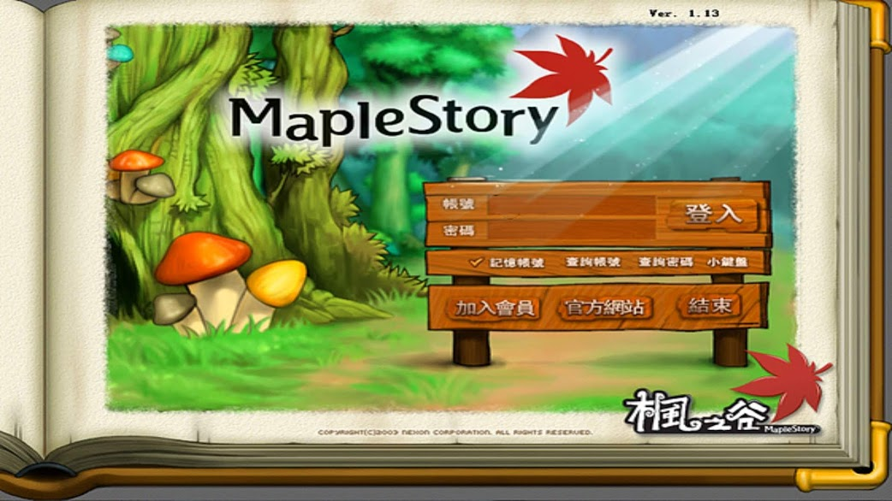
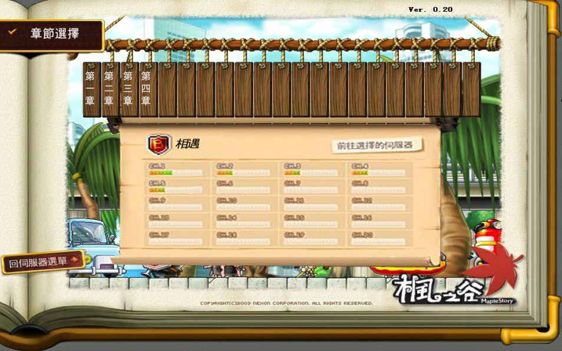
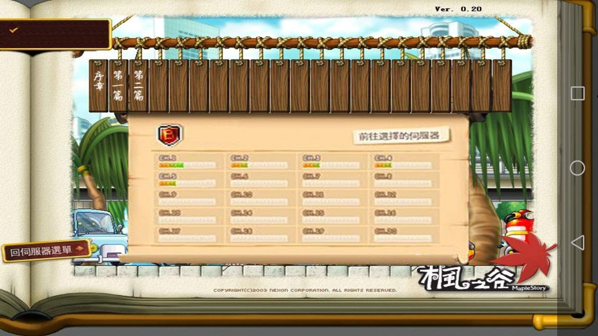
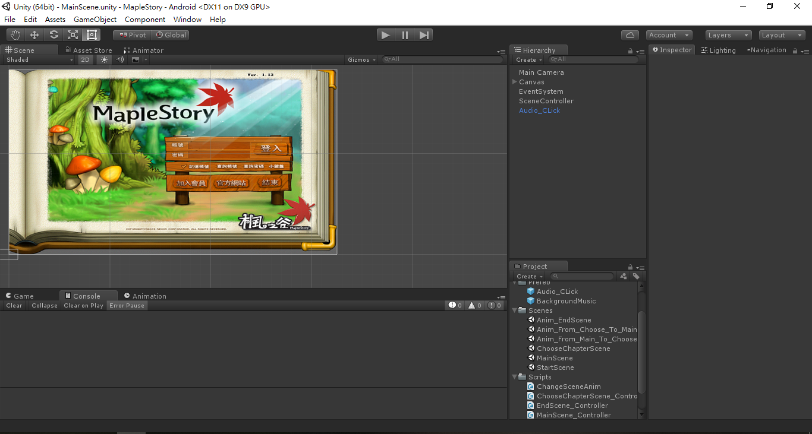

# MapleHistory

## Description
An app for reading novel of MapleStory, which had originated by myself.

## Demo
Demo version: MapleHistory_0829
[Youtube](https://www.youtube.com/watch?v=8MUCEdVlY6o&t=1s)

## What is the progress?
Every time I upload new version, I will describe what I do.

- 2018.9.17 - 第二章節完成
  - 第二章節的故事背景與第一章節沒有差異太大，所以不用耗費太多心力在找尋素材上
  - 優化章節選單，現在選擇不同選單可以同時出現章節名稱
  - 我把部分字體改成開源字體了，因為前陣子字體事件~~我怕被吉~~
  - 這次暫時先開放.apk檔，請下載[MapleHistory_0917.apk](https://github.com/john850512/MapleHistory/blob/master/MapleHistory_0917.apk)並在手機上安裝試玩
  
- 2018.8.31 - 完成遊戲架構(文字冒險遊戲)設計，第一章節完成。
  - 修復章節切換造成的bug
  - 文本對話部分採用Fungus套件
- 2018.7.15 - 設計簡易介面，可以來回切換不同章節。

## How to Start
In th folder, I put the .apk file which you can just install in your android device any just try it.

If you want to use my project to do any things your are interested in, you can import my unitypackage or open my unity project.

## Use Language & Environment
- Unity
- C#
- Visual Studio

## Novel Reference
[是妳，改變了我，在這MapleStory。](https://forum.gamer.com.tw/G1.php?bsn=07650&parent=4682)

## Detail
In the future, I will put the detail of development on my blog.

[ [Unity]Maplesotry文字冒險遊戲 – MapleHistory(未完成) ](https://john850512.wordpress.com/2018/07/15/unitymaplesotry%E6%96%87%E5%AD%97%E5%86%92%E9%9A%AA%E9%81%8A%E6%88%B2-maplehistory%E5%B0%9A%E6%9C%AA%E5%AE%8C%E6%88%90/#more-2455)

If you like this project, welcome to give me some feekback(something like **give me Star** xD).
